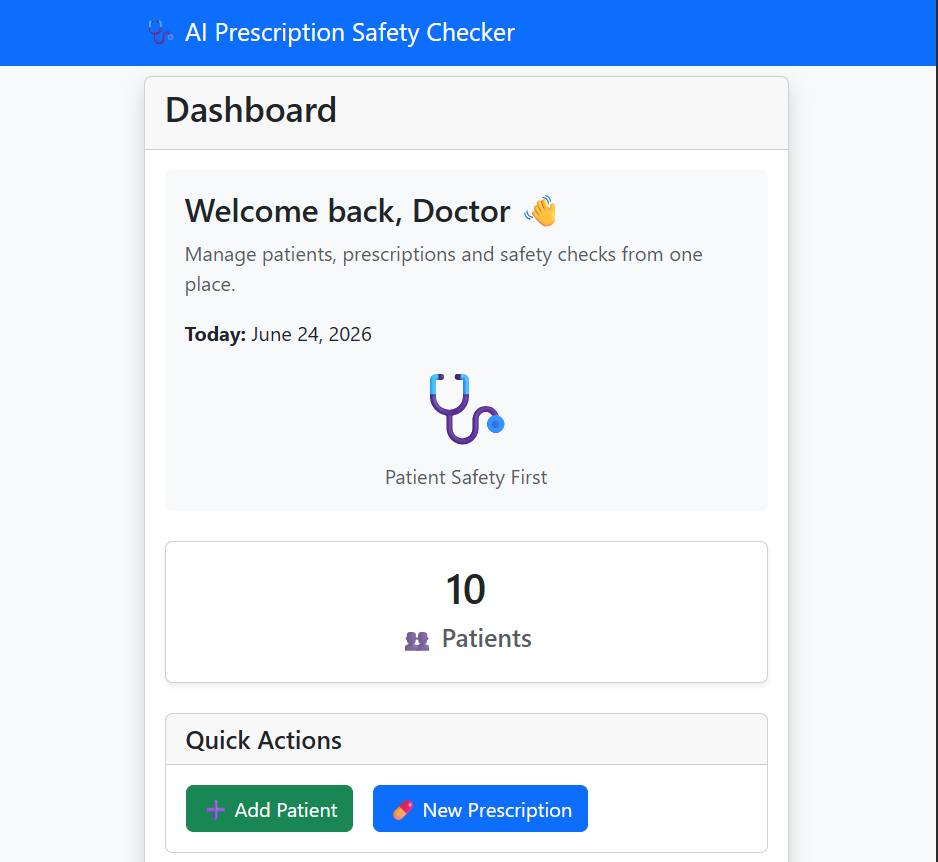
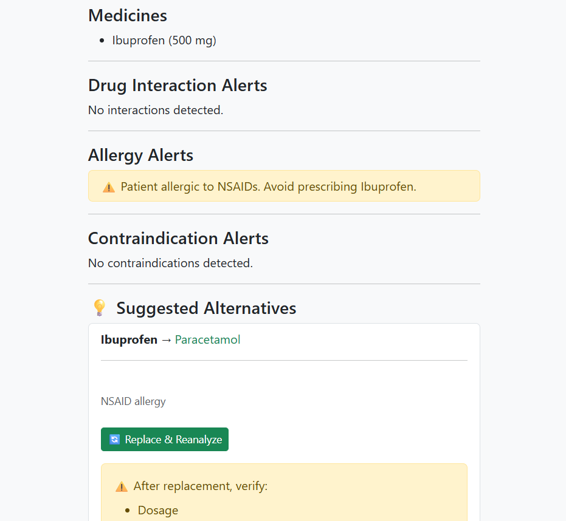
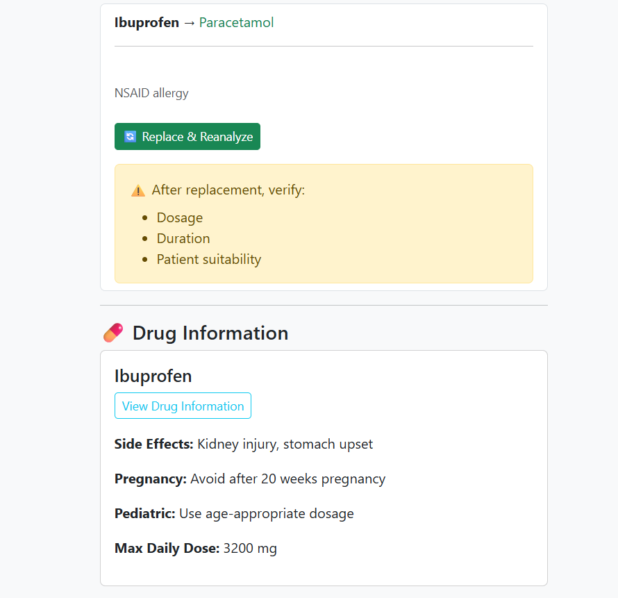
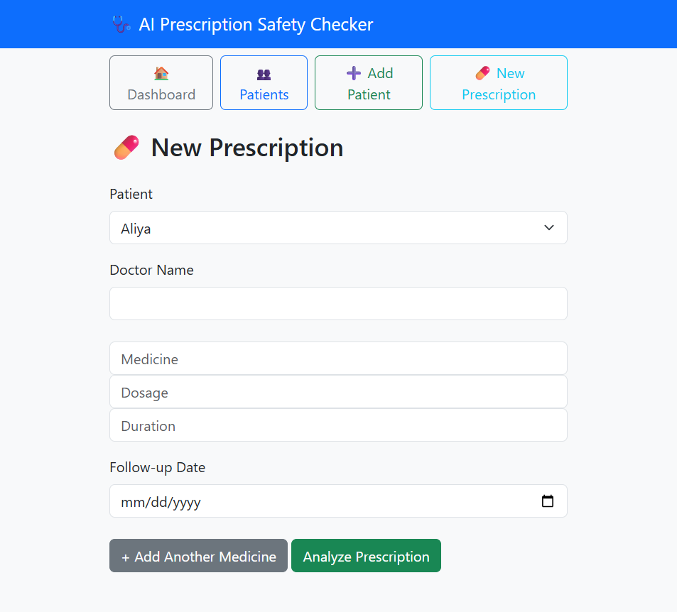
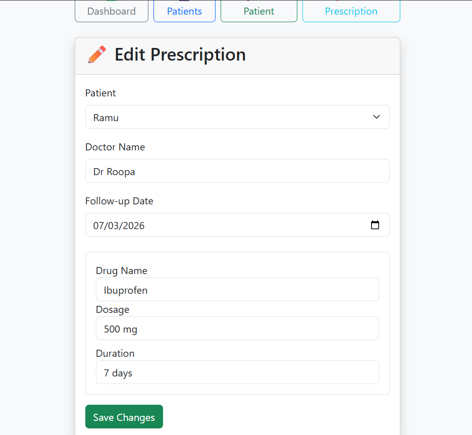

# AI Prescription Safety Checker (Clinical Decision Support System)

A Django-based Clinical Decision Support System (CDSS) designed to assist healthcare professionals in identifying medication-related risks before issuing prescriptions.

The system analyzes prescriptions against patient medical records and generates safety alerts for allergies, contraindications, and potential drug interactions. It also provides alternative medication suggestions and downloadable PDF reports to support safer clinical decision-making.

---

## Project Overview

Medication errors and adverse drug reactions remain a significant challenge in healthcare. This project aims to improve prescription safety by automatically evaluating prescribed medications against patient-specific medical information and generating actionable safety recommendations.

The system serves as a decision-support tool and is intended to assist healthcare professionals during the prescription process.

---

## Key Features

### Patient Management

* Add and manage patient records
* Update patient information
* View patient history
* Automatic age calculation

### Prescription Management

* Create and manage prescriptions
* Edit existing prescriptions
* Follow-up date tracking
* Prescription history timeline

### Safety Analysis Engine

* Drug Interaction Detection
* Allergy Checking
* Contraindication Analysis
* Alternative Drug Suggestions

### Drug Information Support

* Side Effects Information
* Pregnancy Warnings
* Pediatric Warnings
* Maximum Daily Dosage Information

### Reporting

* Prescription Safety Reports
* PDF Report Generation
* Replace-and-Reanalyze Workflow

---

## System Workflow

```text
Patient Record
      ↓
Prescription Entry
      ↓
Safety Analysis Engine
 ├── Allergy Check
 ├── Drug Interaction Check
 ├── Contraindication Check
 └── Alternative Drug Suggestions
      ↓
Safety Report Generation
      ↓
PDF Export
```

## Technology Stack

* Python
* Django
* SQLite
* Bootstrap 5
* HTML
* CSS
* JavaScript
* ReportLab

---

## Project Structure

```text
AI-Prescription-Safety-Checker/
│
├── patients/          # Patient management module
├── prescriptions/     # Prescription management module
├── interactions/      # Drug interaction and safety analysis
├── reports/           # PDF report generation
├── templates/         # Frontend templates
├── static/            # CSS, JS and static assets
├── screenshots/       # Project screenshots
├── db.sqlite3
└── manage.py
```

## Installation

### Clone the Repository

```bash
git clone https://github.com/Aparna-K-Prasad/AI-Prescription-Safety-Checker.git
cd AI-Prescription-Safety-Checker
```

### Install Dependencies

```bash
pip install -r requirements.txt
```

### Apply Migrations

```bash
python manage.py migrate
```

### Run the Application

```bash
python manage.py runserver
```

### Open in Browser

```text
http://127.0.0.1:8000/
```

---

## Screenshots

### Dashboard



### Drug Interaction Detection



### Prescription Analysis




### New Prescription



### Edit Prescription



---

## Key Capabilities

✅ Drug Interaction Detection

✅ Allergy Checking

✅ Contraindication Analysis

✅ Alternative Medication Suggestions

✅ Prescription Safety Reports

✅ PDF Report Generation

✅ Follow-up Tracking

---

## Future Enhancements

* User Authentication & Role-Based Access Control
* Expanded Drug Database
* Machine Learning-Based Risk Prediction
* AI-Powered Prescription Recommendations
* Electronic Health Record (EHR) Integration
* Cloud Deployment
* REST API Support
* Real-Time Drug Database Updates

---

## Learning Outcomes

This project helped in understanding:

* Clinical Decision Support Systems (CDSS)
* Healthcare Informatics
* Django Web Development
* Database Design and Management
* Medical Data Processing
* PDF Report Generation
* Prescription Safety Analysis
* Software Design for Healthcare Applications

---

## Author

**Aparna Prasad**

---

## Disclaimer

This project is developed for educational and research purposes only. It is not intended to replace professional medical advice, diagnosis, or treatment.
